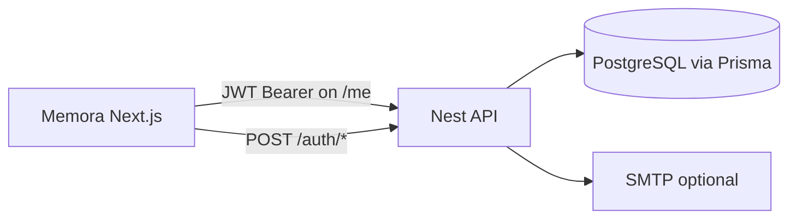

# Memora: Scorecraft auth parity + decks kept

**Status:** Implemented (see repo at time of this document).  
**Source:** Cursor plan export; todos below reflect completion snapshot.

---

## Scope (confirmed)

- **Keep** existing Memora decks API ([`api/`](../../api)) and decks UI under [`web/src/app/[locale]/decks`](../../web/src/app/[locale]/decks).
- **Add** the same auth surface and behavior as Scorecraft (frontend + backend contract: `/auth/register`, `/auth/login`, `/auth/forgot-password`, `/auth/reset-password`, `GET/PATCH /me`).
- **Rebrand** all user-facing and email copy from Scorecraft → **Memora** (no leftover “Scorecraft” strings).
- **Preserve** “connections to the BE”: keep [`ManageService.ts`](../../web/src/shared/services/ManageService.ts), [`apiConstants.ts`](../../web/src/shared/services/apiConstants.ts), and `NEXT_PUBLIC_API_URL` usage; add fetch-based `auth.service.ts` + `config.ts` under `web/src/services/`.

## Why backend work is required

Memora’s API needed a **User** model and JWT auth ([`api/src/app.module.ts`](../../api/src/app.module.ts)); Scorecraft used TypeORM, Memora uses **Prisma** ([`api/prisma/schema.prisma`](../../api/prisma/schema.prisma)) — auth is implemented with Prisma, not a verbatim TypeORM copy.

## Backend ([`api/`](../../api))

1. **Prisma**: `User` model (email unique, optional name, passwordHash, password reset fields, timestamps).
2. **Dependencies**: `@nestjs/jwt`, `bcrypt`, `nodemailer` (+ typings).
3. **Port logic from Scorecraft** (adapt to Prisma): auth controller, service, guard; email module with Memora branding; optional `auth/dev-login`.
4. **Wire** `AuthModule` in `app.module.ts`; CORS and `FRONTEND_URL` for reset links.
5. **Reset link URL**: `${FRONTEND_URL}/reset-password?token=...` (default locale without prefix when using `localePrefix: 'as-needed'`).

## Frontend ([`web/`](../../web))

1. **Services**: `web/src/services/config.ts`, `auth.service.ts` — calls **`/v1/...`** (Nest global prefix).
2. **Auth shell**: `AuthProvider`, `ProtectedRoute`, `GuestOnlyRoute` in [`web/src/app/[locale]/layout.tsx`](../../web/src/app/[locale]/layout.tsx) with `QueryProvider` / `NotificationProvider`.
3. **Locale-aware navigation**: `useRouter` / `Link` from `@/i18n/navigation` for redirects and links.
4. **Routes** under `app/[locale]/`: login, register, forgot-password, reset-password, account.
5. **Forms**: dedicated `auth-form` (`AuthFormBuilder`) separate from i18n `FormBuilder`.
6. **Design tokens**: CSS variables in [`web/src/app/globals.css`](../../web/src/app/globals.css) for `--primary`, `--destructive`, etc.
7. **Navigation**: [`Navigation`](../../web/src/shared/components/Navigation/Navigation.tsx) with i18n links.
8. **Home**: protected “Welcome to Memora” on [`[locale]/page.tsx`](../../web/src/app/[locale]/page.tsx).
9. **Decks**: `ProtectedRoute` on decks page; `getAuthHeaders()` + `authToken` for deck API calls via `ManageService`.
10. **useLogout**: i18n router, redirect to `/login`.

## Naming and cleanup

- Rebrand user-facing strings to Memora; keep `ManageService` / `apiConstants`.

## Verification

- Manual: register → login → home → account → logout; forgot/reset password; `/decks` unauthenticated → login.
- `npm test` / `npm run lint` in `web`.

## Risk notes

- Two form systems: main i18n `FormBuilder` vs auth-only `AuthFormBuilder`.
- Deck API uses `AuthGuard` on controller (JWT required).

---

## Original todo snapshot (completed)

| id | content |
|----|---------|
| api-prisma-user | User model + migration; jwt/bcrypt/nodemailer |
| api-auth-module | AuthModule (Prisma, guard, controller, email) |
| web-services-auth | config + auth.service; token key `authToken` |
| web-auth-ui | AuthProvider, `[locale]` routes, i18n router, nav, home |
| web-forms-tokens | Auth form builder; globals.css tokens |
| decks-protect | ProtectedRoute; JWT on deck requests |
| cleanup-rebrand | Remove duplicate routes; Memora naming |
